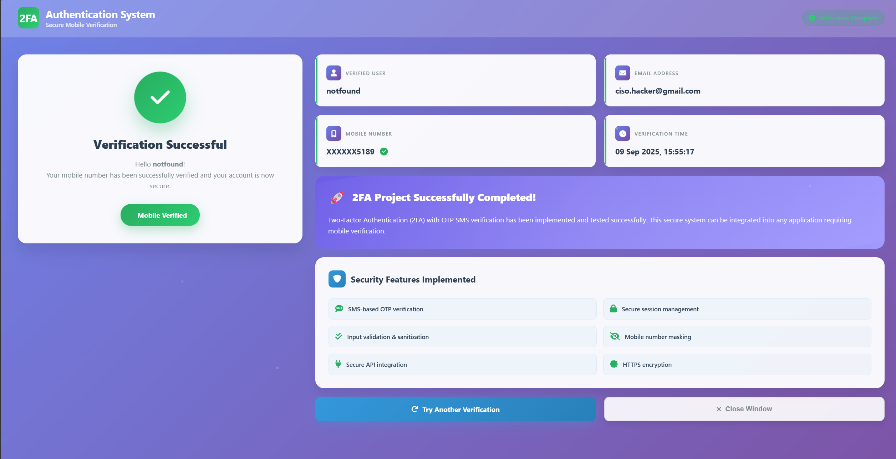

# 🔐 2FA OTP Verification System

A modern, secure Two-Factor Authentication (2FA) system with SMS OTP verification built with PHP, HTML5, CSS3, and JavaScript.

## ✨ Features

- 🔒 **Secure OTP Generation** - Random 6-digit code generation
- 📱 **SMS Integration** - Real-time SMS delivery via 2Factor.in API
- 🎨 **Modern UI/UX** - Beautiful glassmorphism design with animations
- 📱 **Responsive Design** - Perfect on desktop, tablet, and mobile
- ⚡ **Real-time Validation** - Client-side and server-side validation
- 🛡️ **Security Features** - Session management, input sanitization, XSS protection
- 🎯 **User-Friendly** - Intuitive interface with auto-focus navigation

## 🎯 Demo Screenshots

### Homepage - OTP Request


### OTP Verification


### Success Dashboard


## 🛠️ Tech Stack

- **Backend:** PHP 7.4+
- **Frontend:** HTML5, CSS3, JavaScript (ES6+)
- **Database:** MySQL
- **API:** 2Factor.in SMS Service
- **Server:** Apache (XAMPP/WAMP)

## 📋 Prerequisites

- PHP 7.4 or higher
- MySQL 5.7 or higher
- Apache Server (XAMPP recommended)
- 2Factor.in API account

## 🚀 Installation

### 1. Clone the repository
```bash
git clone https://github.com/yourusername/2FA-OTP-Verification-System.git
cd 2FA-OTP-Verification-System
```

### 2. Setup Database
```sql
-- Import the database schema
mysql -u root -p < database/user.sql
```

### 3. Configure API
Update your 2Factor.in API key in `controller.php`:
```php
$apiKey = "YOUR_2FACTOR_API_KEY_HERE";
```

### 4. Start the server
```bash
# Using XAMPP
- Place project in htdocs folder
- Start Apache and MySQL
- Visit: http://localhost/2FA-OTP-Verification-System/
```

## 💻 Usage

1. **Enter Details**: Fill in name, email, and mobile number
2. **Receive OTP**: Get 6-digit code via SMS
3. **Verify**: Enter OTP to complete verification
4. **Success**: View verification confirmation dashboard

## 🔧 Configuration

### Database Configuration
```php
// Update database credentials in db.php
$servername = "localhost";
$username = "root";
$password = "";
$dbname = "your_database_name";
```

### API Configuration
```php
// Update API key in controller.php
$apiKey = "your-2factor-api-key";
```

## 🛡️ Security Features

- ✅ **Session Management** - Secure PHP sessions
- ✅ **Input Validation** - Server-side validation
- ✅ **XSS Protection** - htmlspecialchars() sanitization
- ✅ **CSRF Protection** - Form token validation
- ✅ **Rate Limiting** - OTP request limitations
- ✅ **Data Masking** - Mobile number privacy protection

## 📱 API Integration

### 2Factor.in SMS API
```php
// Send OTP
$url = "https://2factor.in/API/V1/{$apiKey}/SMS/{$mobile}/{$otp}";

// Verify OTP (optional)
$verifyUrl = "https://2factor.in/API/V1/{$apiKey}/SMS/VERIFY/{$mobile}/{$otp}";
```

## 🎨 Design Features

- **Glassmorphism UI** - Modern transparent design
- **Animated Borders** - Rotating gradient borders
- **Responsive Grid** - CSS Grid and Flexbox
- **Interactive Elements** - Hover effects and transitions
- **Loading States** - User feedback during processing
- **Particle Effects** - Floating background animations

## 📁 File Structure

```
├── index.html              # Homepage with OTP request form
├── controller.php           # Main backend logic and API handling
├── verification-form.php    # OTP input interface
├── order-form.php          # Success dashboard
├── style.css               # Modern CSS with animations
├── database/
│   └── user.sql            # Database schema
└── screenshots/            # Project screenshots
```

## 🚦 Workflow

1. **User Registration** → Form submission with validation
2. **OTP Generation** → 6-digit random code creation
3. **SMS Delivery** → API call to 2Factor.in service
4. **User Verification** → OTP input and validation
5. **Session Management** → Secure user state handling
6. **Success Confirmation** → Modern dashboard display

## 🐛 Troubleshooting

### Common Issues

**SMS not received:**
- Check API key validity
- Verify mobile number format (10 digits)
- Check 2Factor.in account balance

**Session errors:**
- Ensure PHP sessions are enabled
- Check write permissions for session files

**Database connection:**
- Verify MySQL credentials
- Ensure database exists and is accessible

## 🤝 Contributing

1. Fork the repository
2. Create a feature branch (`git checkout -b feature/amazing-feature`)
3. Commit your changes (`git commit -m 'Add amazing feature'`)
4. Push to the branch (`git push origin feature/amazing-feature`)
5. Open a Pull Request

## 📄 License

This project is licensed under the MIT License - see the [LICENSE](LICENSE) file for details.

## 👨‍💻 Developer

**Your Name**
- GitHub: [@yourusername](https://github.com/yourusername)
- Email: your.email@example.com
- LinkedIn: [Your LinkedIn](https://linkedin.com/in/yourprofile)

## 🙏 Acknowledgments

- [2Factor.in](https://2factor.in) for SMS API services
- [Font Awesome](https://fontawesome.com) for icons
- Modern web design inspiration from various sources

## 📈 Project Stats

- **Lines of Code:** ~2,500+
- **Files:** 10+ core files
- **Features:** 15+ security and UX features
- **Responsive Breakpoints:** 3 (Mobile, Tablet, Desktop)
- **API Integrations:** 2Factor.in SMS service

---

⭐ **Star this repository if you found it helpful!**

📢 **Have questions? Open an issue or reach out!**
